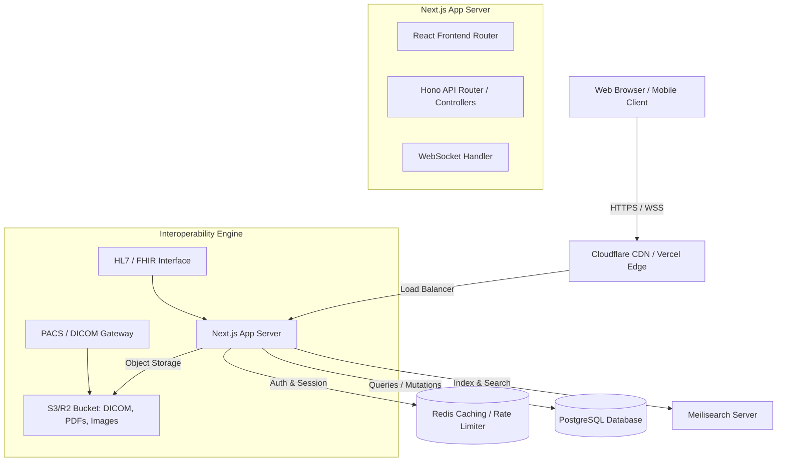
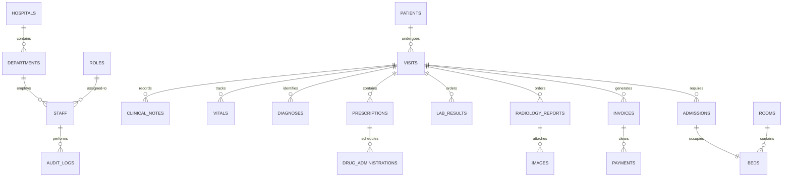

# Implementation Plan: Enterprise-Grade Electronic Health Record (EHR) System

This document outlines the system architecture, database schema, API specifications, and development roadmap for building a modern, cloud-native, and interoperable EHR platform.

---

## 1. System Architecture

A hybrid architecture using a Next.js App Router (React, Tailwind CSS, TypeScript, TanStack Query) with Hono running in Next.js edge API routes for maximum throughput, low-latency API handling, and type safety across frontend and backend.



---

## 2. Database Schema (PostgreSQL)

Here is the normalized PostgreSQL database schema, including indexing strategies for handling millions of records.



### Core SQL DDL Schema
```sql
-- Role and User Management
CREATE TABLE roles (
    id UUID PRIMARY KEY DEFAULT gen_random_uuid(),
    name VARCHAR(50) UNIQUE NOT NULL,
    description TEXT,
    created_at TIMESTAMP WITH TIME ZONE DEFAULT CURRENT_TIMESTAMP
);

CREATE TABLE permissions (
    id UUID PRIMARY KEY DEFAULT gen_random_uuid(),
    code VARCHAR(100) UNIQUE NOT NULL,
    description TEXT
);

CREATE TABLE role_permissions (
    role_id UUID REFERENCES roles(id) ON DELETE CASCADE,
    permission_id UUID REFERENCES permissions(id) ON DELETE CASCADE,
    PRIMARY KEY (role_id, permission_id)
);

CREATE TABLE hospitals (
    id UUID PRIMARY KEY DEFAULT gen_random_uuid(),
    name VARCHAR(255) NOT NULL,
    address TEXT,
    phone VARCHAR(20),
    email VARCHAR(100),
    created_at TIMESTAMP WITH TIME ZONE DEFAULT CURRENT_TIMESTAMP
);

CREATE TABLE departments (
    id UUID PRIMARY KEY DEFAULT gen_random_uuid(),
    hospital_id UUID REFERENCES hospitals(id) ON DELETE CASCADE,
    name VARCHAR(100) NOT NULL,
    code VARCHAR(20) UNIQUE NOT NULL
);

CREATE TABLE staff (
    id UUID PRIMARY KEY DEFAULT gen_random_uuid(),
    hospital_id UUID REFERENCES hospitals(id),
    department_id UUID REFERENCES departments(id),
    role_id UUID REFERENCES roles(id),
    first_name VARCHAR(100) NOT NULL,
    last_name VARCHAR(100) NOT NULL,
    email VARCHAR(100) UNIQUE NOT NULL,
    phone VARCHAR(20),
    password_hash VARCHAR(255) NOT NULL,
    mfa_secret VARCHAR(100),
    mfa_enabled BOOLEAN DEFAULT FALSE,
    status VARCHAR(20) DEFAULT 'ACTIVE', -- ACTIVE, INACTIVE, SUSPENDED
    created_at TIMESTAMP WITH TIME ZONE DEFAULT CURRENT_TIMESTAMP
);

-- Patient Registry
CREATE TABLE patients (
    id UUID PRIMARY KEY DEFAULT gen_random_uuid(),
    mrn VARCHAR(50) UNIQUE NOT NULL, -- Medical Record Number
    national_id VARCHAR(50) UNIQUE,
    first_name VARCHAR(100) NOT NULL,
    last_name VARCHAR(100) NOT NULL,
    date_of_birth DATE NOT NULL,
    gender VARCHAR(20) NOT NULL,
    phone VARCHAR(20),
    email VARCHAR(100),
    address TEXT,
    blood_group VARCHAR(5),
    genotype VARCHAR(5),
    emergency_contact_name VARCHAR(100),
    emergency_contact_phone VARCHAR(20),
    insurance_provider VARCHAR(100),
    insurance_policy_number VARCHAR(100),
    created_at TIMESTAMP WITH TIME ZONE DEFAULT CURRENT_TIMESTAMP
);

-- Visit & Clinical Tracking
CREATE TABLE visits (
    id UUID PRIMARY KEY DEFAULT gen_random_uuid(),
    patient_id UUID REFERENCES patients(id) ON DELETE CASCADE,
    doctor_id UUID REFERENCES staff(id),
    visit_type VARCHAR(50) NOT NULL, -- OUTPATIENT, INPATIENT, EMERGENCY, TELEMEDICINE
    status VARCHAR(20) DEFAULT 'CHECKED_IN', -- CHECKED_IN, IN_PROGRESS, COMPLETED, CANCELLED
    check_in_time TIMESTAMP WITH TIME ZONE DEFAULT CURRENT_TIMESTAMP,
    check_out_time TIMESTAMP WITH TIME ZONE
);

CREATE TABLE vitals (
    id UUID PRIMARY KEY DEFAULT gen_random_uuid(),
    visit_id UUID REFERENCES visits(id) ON DELETE CASCADE,
    recorded_at TIMESTAMP WITH TIME ZONE DEFAULT CURRENT_TIMESTAMP,
    recorded_by UUID REFERENCES staff(id),
    temperature NUMERIC(4, 2), -- Celsius
    systolic_bp INT,
    diastolic_bp INT,
    heart_rate INT,
    respiratory_rate INT,
    oxygen_saturation NUMERIC(5, 2), -- %
    weight NUMERIC(5, 2), -- kg
    height NUMERIC(5, 2), -- cm
    bmi NUMERIC(4, 2),
    pain_score INT
);

CREATE TABLE clinical_notes (
    id UUID PRIMARY KEY DEFAULT gen_random_uuid(),
    visit_id UUID REFERENCES visits(id) ON DELETE CASCADE,
    author_id UUID REFERENCES staff(id),
    note_type VARCHAR(50) NOT NULL, -- SOAP, PROGRESS, DISCHARGE, OPERATIVE
    subjective TEXT,
    objective TEXT,
    assessment TEXT,
    plan TEXT,
    digital_signature TEXT,
    signed_at TIMESTAMP WITH TIME ZONE
);

-- Diagnostics & Medications
CREATE TABLE diagnoses (
    id UUID PRIMARY KEY DEFAULT gen_random_uuid(),
    visit_id UUID REFERENCES visits(id) ON DELETE CASCADE,
    icd10_code VARCHAR(10) NOT NULL,
    description TEXT NOT NULL,
    diagnosed_by UUID REFERENCES staff(id),
    status VARCHAR(20) DEFAULT 'ACTIVE' -- ACTIVE, RESOLVED, CHRONIC
);

CREATE TABLE prescriptions (
    id UUID PRIMARY KEY DEFAULT gen_random_uuid(),
    visit_id UUID REFERENCES visits(id) ON DELETE CASCADE,
    doctor_id UUID REFERENCES staff(id),
    prescribed_at TIMESTAMP WITH TIME ZONE DEFAULT CURRENT_TIMESTAMP,
    status VARCHAR(20) DEFAULT 'PENDING' -- PENDING, DISPENSED, CANCELLED
);

CREATE TABLE prescription_items (
    id UUID PRIMARY KEY DEFAULT gen_random_uuid(),
    prescription_id UUID REFERENCES prescriptions(id) ON DELETE CASCADE,
    drug_name VARCHAR(255) NOT NULL,
    dosage VARCHAR(50) NOT NULL,
    frequency VARCHAR(50) NOT NULL,
    duration VARCHAR(50) NOT NULL,
    notes TEXT
);

-- Labs & Radiology
CREATE TABLE lab_orders (
    id UUID PRIMARY KEY DEFAULT gen_random_uuid(),
    visit_id UUID REFERENCES visits(id) ON DELETE CASCADE,
    ordered_by UUID REFERENCES staff(id),
    test_name VARCHAR(255) NOT NULL,
    status VARCHAR(20) DEFAULT 'PENDING', -- PENDING, SAMPLE_COLLECTED, PROCESSING, COMPLETED
    ordered_at TIMESTAMP WITH TIME ZONE DEFAULT CURRENT_TIMESTAMP
);

CREATE TABLE lab_results (
    id UUID PRIMARY KEY DEFAULT gen_random_uuid(),
    lab_order_id UUID REFERENCES lab_orders(id) ON DELETE CASCADE,
    analyzed_by UUID REFERENCES staff(id),
    result_data JSONB NOT NULL, -- Key-value parameters & reference ranges
    approved_by UUID REFERENCES staff(id),
    approved_at TIMESTAMP WITH TIME ZONE
);

CREATE TABLE radiology_orders (
    id UUID PRIMARY KEY DEFAULT gen_random_uuid(),
    visit_id UUID REFERENCES visits(id) ON DELETE CASCADE,
    ordered_by UUID REFERENCES staff(id),
    modality VARCHAR(20) NOT NULL, -- XRAY, MRI, CT, ULTRASOUND
    body_part VARCHAR(100) NOT NULL,
    status VARCHAR(20) DEFAULT 'PENDING',
    ordered_at TIMESTAMP WITH TIME ZONE DEFAULT CURRENT_TIMESTAMP
);

CREATE TABLE radiology_reports (
    id UUID PRIMARY KEY DEFAULT gen_random_uuid(),
    radiology_order_id UUID REFERENCES radiology_orders(id) ON DELETE CASCADE,
    radiologist_id UUID REFERENCES staff(id),
    findings TEXT NOT NULL,
    impression TEXT NOT NULL,
    dicom_url VARCHAR(512), -- Path in Cloudflare R2 / S3
    approved_at TIMESTAMP WITH TIME ZONE
);

-- Ward & Bed Management
CREATE TABLE rooms (
    id UUID PRIMARY KEY DEFAULT gen_random_uuid(),
    hospital_id UUID REFERENCES hospitals(id),
    room_number VARCHAR(20) NOT NULL,
    room_type VARCHAR(50) NOT NULL, -- GENERAL, ICU, ISOLATION
    status VARCHAR(20) DEFAULT 'AVAILABLE'
);

CREATE TABLE beds (
    id UUID PRIMARY KEY DEFAULT gen_random_uuid(),
    room_id UUID REFERENCES rooms(id) ON DELETE CASCADE,
    bed_number VARCHAR(20) NOT NULL,
    status VARCHAR(20) DEFAULT 'AVAILABLE' -- AVAILABLE, OCCUPIED, CLEANING, MAINTENANCE
);

CREATE TABLE admissions (
    id UUID PRIMARY KEY DEFAULT gen_random_uuid(),
    visit_id UUID REFERENCES visits(id) ON DELETE CASCADE,
    bed_id UUID REFERENCES beds(id),
    admitted_at TIMESTAMP WITH TIME ZONE DEFAULT CURRENT_TIMESTAMP,
    discharged_at TIMESTAMP WITH TIME ZONE
);

-- Billing & Finances
CREATE TABLE invoices (
    id UUID PRIMARY KEY DEFAULT gen_random_uuid(),
    visit_id UUID REFERENCES visits(id) ON DELETE CASCADE,
    total_amount NUMERIC(10, 2) NOT NULL,
    insurance_covered NUMERIC(10, 2) DEFAULT 0.00,
    patient_payable NUMERIC(10, 2) NOT NULL,
    status VARCHAR(20) DEFAULT 'UNPAID', -- UNPAID, PARTIALLY_PAID, PAID, VOIDED
    created_at TIMESTAMP WITH TIME ZONE DEFAULT CURRENT_TIMESTAMP
);

CREATE TABLE payments (
    id UUID PRIMARY KEY DEFAULT gen_random_uuid(),
    invoice_id UUID REFERENCES invoices(id) ON DELETE CASCADE,
    amount NUMERIC(10, 2) NOT NULL,
    payment_method VARCHAR(50) NOT NULL, -- CASH, CARD, INSURANCE, BANK_TRANSFER
    processed_by UUID REFERENCES staff(id),
    processed_at TIMESTAMP WITH TIME ZONE DEFAULT CURRENT_TIMESTAMP
);

-- System Infrastructure
CREATE TABLE audit_logs (
    id UUID PRIMARY KEY DEFAULT gen_random_uuid(),
    user_id UUID REFERENCES staff(id) ON DELETE SET NULL,
    action VARCHAR(255) NOT NULL,
    target_table VARCHAR(100),
    target_id UUID,
    ip_address VARCHAR(45),
    user_agent TEXT,
    old_values JSONB,
    new_values JSONB,
    timestamp TIMESTAMP WITH TIME ZONE DEFAULT CURRENT_TIMESTAMP
);
```

---

## 3. Role-Permission Matrix

Below is the Access Control design ensuring strict HIPAA and role-based isolation.

| Role | Target Dashboard | Read Patient EMR | Edit Notes/Vitals | Order Labs/Rad | Prescribe Drugs | Dispense/Verify | Analyze Samples | Edit Billing | System Settings |
| :--- | :--- | :---: | :---: | :---: | :---: | :---: | :---: | :---: | :---: |
| **Super Admin** | Admin Suite | Yes | No | No | No | No | No | Yes | Yes |
| **Hospital Admin** | Hospital Suite | Yes | No | No | No | No | No | Yes | No |
| **Doctor** | Doctor Console | Yes | Yes | Yes | Yes | No | No | No | No |
| **Nurse** | Nurse Console | Yes | Yes (Vitals/Notes) | No | No | No | No | No | No |
| **Pharmacist** | Pharmacy Hub | Yes | No | No | No | Yes | No | No | No |
| **Lab Scientist** | Lab Worklist | Yes (Relevant) | No | No | No | No | Yes | No | No |
| **Radiologist** | Imaging Hub | Yes (Relevant) | No | No | No | No | Yes (Reports) | No | No |
| **Receptionist** | Registration Desk | Yes (Demographics) | No | No | No | No | No | Yes (Initiate) | No |
| **Accountant** | Billing Center | No | No | No | No | No | No | Yes | No |
| **Patient** | Patient Portal | Self Only | No | No | No | No | No | View Self | No |

---

## 4. UI/UX Interface Architecture

We will build a high-fidelity Single Page Application layout using a modern, unified dashboard wrapper featuring:
1. **Collapsible Navigation Sidebar**: Tailored specifically to the active user role.
2. **Global Command Palette (`Ctrl+K`)**: Rapid search across patients, doctors, records, and navigation targets.
3. **Responsive Grid Dashboard**: Visual analytics cards using standard SVG metrics and clean canvas representations.
4. **Theme Toggler**: Smooth dark-mode transitions using Tailwind state modifiers.
5. **Interactive Workspaces**:
   - **Doctor Consultation Room**: SOAP notes builder, vitals chart, diagnosis search.
   - **Nurse Observation Console**: Vital signs logger, care plan checklist.
   - **Pharmacist Dispensation Queue**: Inventory validation, prescription audit.
   - **Laboratory Worklist**: Sample barcode tracking, result submission form.
   - **Radiology DICOM Viewer**: Canvas-based PACS simulation with brightness/contrast adjustments.
   - **Receptionist Desk**: Interactive patient registration wizard.
   - **Billing Hub**: Live split invoice calculator (Cash/Insurance).

---

## 5. API Specification (REST + WebSocket)

All paths prefixed with `/api/v1`.

### Authentication
* `POST /auth/login` - Authenticates user credentials, returns JWT in Secure HTTP-only cookie.
* `POST /auth/mfa/verify` - Validates TOTP code for active MFA.
* `POST /auth/logout` - Revokes sessions, clears credentials cookie.

### Patients
* `GET /patients` - Paginated patients list, matches search parameter query.
* `POST /patients` - Registers a new patient.
* `GET /patients/:id` - Retrieves complete clinical profile.

### Clinical / Visits
* `POST /visits` - Checks in a patient or registers walk-in/appointment.
* `POST /visits/:id/vitals` - Records new vital signs.
* `POST /visits/:id/notes` - Submits SOAP, progress, or operative note.

### Diagnostics & Fulfillment
* `GET /labs/pending` - Retrieves laboratory queues.
* `PUT /labs/:id/results` - Submits analyzer results.
* `GET /radiology/:id` - Downloads DICOM metadata and references.
* `GET /pharmacy/prescriptions` - Live medication orders.

---

## 6. Integration & Standards Compliance Plan

### HL7 v2 / FHIR (Fast Healthcare Interoperability Resources)
* **Standard Mapping**: Patient resources are stored and serialized adhering to the HL7 FHIR standard specifications (e.g., `Patient`, `Observation`, `Encounter`, `MedicationRequest`).
* **Interoperability Endpoint**: Expose a `/fhir/r4` path compliant with RESTful FHIR API standards.

### DICOM Compliance
* **PACS Gateway**: Simulates connection to Picture Archiving and Communication System using DICOM Web client APIs (WADO-RS, QIDO-RS).
* **Radiology Viewer**: A client-side canvas renderer depicting multi-frame medical images with basic window leveling.

### ICD-10 Coding
* Integration with a lightweight local medical dictionary to map search criteria directly to valid ICD-10 diagnostic codes.

---

## 7. Open Questions & User Review Required

> [!IMPORTANT]
> **Data Mocking Strategy**: As this is an offline/local evaluation implementation, we propose configuring the backend with a local file-based database or in-memory repository (simulating Postgres/Prisma) alongside fully simulated external hardware (DICOM PACS viewer, Lab Analyzers, and barcode scanners) so the application is fully interactive and runs with zero setup. Please confirm if this is acceptable, or if you want us to set up a Dockerized PostgreSQL.
>
> **Development Framework**: We will proceed using a Next.js (App Router) + TypeScript + Tailwind CSS application configured as a Single Page Experience showcasing all active roles with real-time switching to make it simple to review and interact with.

---

## 8. Verification & Deployment Plan

### Testing
* Run unit tests covering clinical calculations (e.g., BMI calculator, medication dosing alerts).
* Run end-to-end user journeys (Patient check-in -> Triage & Vitals -> Doctor SOAP formulation -> Billing generation).

### Deployment
* Dockerfile configured with a multi-stage build containing production Next.js builds.
